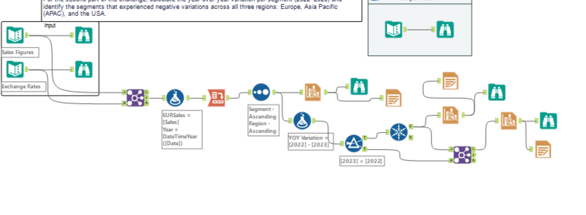

# 🌍 Global Sales Descriptive & YoY Variation Analysis (2022–2023)
### Multi-Currency Data Pipeline | Alteryx Designer · Join · Crosstab · Formula · FX Conversion · PDF Report Generation

> **3 regions. 5 business segments. Multi-currency transactions normalized to EUR.** — A structured descriptive and diagnostic analytics pipeline that answers the question every regional sales director needs answered: *"Which segments are growing — and which are silently shrinking across every market we operate in?"*

---

## 📌 Project at a Glance

| Dimension | Value |
|---|---|
| 🌐 Regions Analyzed | **3 — APAC · Europe · USA** |
| 📦 Business Segments | **5 — Channel Partners · Enterprise · Government · Midmarket · Small Business** |
| 📋 Output Records (Part 1) | **15 records** — full 3×5 region-segment matrix for 2022 and 2023 |
| 💶 Base Reporting Currency | **Euro (EUR)** — multi-currency FX normalization applied |
| 📉 Segments with Universal Decline | **2 segments declined across ALL 3 regions simultaneously** |
| 💸 Largest Single Contraction | **€17.1M drop** — Europe Government (€69.5M → €52.3M) |
| 🏆 Strongest Growth | **+27.4% — APAC Government** (€11.5M → €14.7M) |
| 🛠️ Tool | **Alteryx Designer** — Join · Filter · Formula · Summarize · Crosstab · Sort · Unique · Interactive Chart · Render |

---

## 🎯 Business Problem

A global company tracks sales across 3 regions and 5 business segments — but every country records revenue in its **local currency**. Without normalization, comparing APAC vs Europe vs USA is comparing apples to oranges.

**This pipeline solves that in 2 parts:**

1. Build a clean **EUR-normalized summary table** showing total sales per region × segment for 2022 and 2023 — 15 records, zero noise, audit-ready
2. Calculate **year-over-year (YoY) variation** per segment and identify which segments experienced **negative variation across ALL THREE regions** — not just one market

That second filter is the hard part. A segment declining in one region could be a local anomaly. A segment declining in **every region simultaneously** is a strategic red flag.

---

## 🔍 Key Insights — Real Numbers, Real Decisions

### 📊 Part 1 — Full EUR Sales Summary (2022 vs 2023)

| Region | Segment | 2022 (€) | 2023 (€) | Direction |
|---|---|---|---|---|
| APAC | Channel Partners | 5,431,523.99 | 6,681,533.69 | ✅ +23.0% |
| APAC | Enterprise | 3,628,956.10 | 2,786,166.65 | 🔴 −23.2% |
| APAC | Government | 11,530,750.10 | 14,685,752.02 | ✅ **+27.4%** |
| APAC | Midmarket | 7,576,854.57 | 6,971,593.72 | 🔴 −8.0% |
| APAC | Small Business | 5,761,163.39 | 5,785,153.26 | ✅ +0.4% |
| Europe | Channel Partners | 16,477,394.63 | 16,297,522.04 | 🟡 −1.1% |
| Europe | Enterprise | 15,236,444.47 | 10,500,638.78 | 🔴 −31.1% |
| Europe | Government | 69,465,891.47 | 52,301,051.53 | 🔴 −24.7% |
| Europe | Midmarket | 26,521,197.11 | 17,751,555.88 | 🔴 −33.1% |
| Europe | Small Business | 10,847,044.51 | 15,627,839.43 | ✅ +44.1% |
| USA | Channel Partners | 5,613,400.37 | 6,681,533.69 | ✅ +19.0% |
| USA | Enterprise | 3,673,733.11 | 2,786,166.65 | 🔴 −24.2% |
| USA | Government | 12,849,411.80 | 14,685,752.02 | ✅ +14.3% |
| USA | Midmarket | 7,743,178.46 | 6,971,593.72 | 🔴 −10.0% |
| USA | Small Business | 6,145,936.29 | 5,785,153.26 | 🔴 −5.9% |

---

### 🚨 Part 2 — Segments Declining Across ALL 3 Regions Simultaneously

> **Logic applied:** YoY Variation = [2022] − [2023] → Filter: 2023 < 2022 → Unique by Segment across all 3 regions

| Segment | APAC YoY | Europe YoY | USA YoY | Verdict |
|---|---|---|---|---|
| **Enterprise** | −€842,789 | −€4,735,806 | −€887,566 | 🔴 **Universal decline** |
| **Midmarket** | −€605,261 | −€8,769,641 | −**€771,585** | 🔴 **Universal decline** |

**Why this matters:** These 2 segments declined in every single region — APAC, Europe, AND USA. That rules out regional economic factors, local competition, or territory-specific execution problems. The pattern points squarely at **segment-level structural issues** — pricing uncompetitiveness for mid-sized buyers, shifting buying behaviour in the Enterprise tier, or product-market fit erosion.

---

### 💡 Insight Deep-Dives

**1. 🔴 Europe is the biggest drag — but not uniformly**
Europe had 4 of the 5 segments decline, including the catastrophic Government drop of **€17.1M** (€69.5M → €52.3M, −24.7%). This is the **single largest absolute revenue contraction** in the entire dataset. The one bright spot: Europe Small Business surged **+44.1%** (€10.8M → €15.6M) — suggesting strong SME penetration while large-contract sales stalled.

**2. 🏆 APAC Government is the standout growth story**
APAC Government grew **+27.4%** — from €11.5M to €14.7M — the strongest relative growth rate of any segment-region combination. In a dataset where most large-contract segments contracted, this is a meaningful outlier worth examining for replication strategy.

**3. 🔴 Enterprise collapsed globally — every region, every geography**
Enterprise declined −23.2% in APAC, −31.1% in Europe, and −24.2% in USA. That's a **consistent ~25% contraction** in the Enterprise segment worldwide — a signal that demands executive attention, not just a reporting footnote.

**4. ✅ Channel Partners is a reliable growth engine**
Channel Partners grew in all 3 regions: +23.0% (APAC), −1.1% (Europe, near-flat), +19.0% (USA). It's the only segment that was positive or neutral everywhere — suggesting the indirect sales model is outperforming direct channels in the current environment.

**5. 🔴 Midmarket: the hidden problem segment**
Midmarket declined across all 3 regions — but the Europe number (−33.1%, from €26.5M to €17.8M) is the most alarming. A drop of **€8.8M** in a single segment in a single region is a strategic priority, not a monitoring item.

---

## 🏗️ Alteryx Workflow — Full Pipeline Architecture

```
📦 Global Sales Multi-Currency Pipeline
│
├── INPUT LAYER
│   ├── 📊 Sales Data (local currency, multi-region)
│   └── 💱 Exchange Rate Table (local currency → EUR)
│
├── STEP 1 → Filter
│   └── Remove records where Sale Price = NULL
│       (prevents zero-value FX conversions from skewing totals)
│
├── STEP 2 → Join
│   └── Merge Sales with FX Rate table on currency/date key
│       → Each transaction now carries its EUR conversion rate
│
├── STEP 3 → Formula: Currency Conversion
│   └── [EUR Sales] = [Sale Price] × [Exchange Rate]
│   └── [Year] = DateTimeYear([Sale Date])
│
├── STEP 4 → Summarize
│   └── Group by: Region + Segment + Year
│       → SUM of EUR Sales per group
│       → 30 records (3 regions × 5 segments × 2 years)
│
├── STEP 5 → Crosstab
│   └── Pivot Year into columns: 2022 | 2023
│       → 15 records (3 regions × 5 segments)
│
├── STEP 6 → Sort
│   └── Order by Segment ASC, Region ASC
│
├── ─── BRANCH A: PART 1 OUTPUT ───────────────────────────────
│   └── ✅ 15-record EUR Summary Table — clean, audit-ready
│
└── ─── BRANCH B: PART 2 PIPELINE ────────────────────────────
    │
    ├── Formula: [YoY Variation] = [2022] - [2023]
    │
    ├── Filter: [2023] < [2022]  →  keep only declining rows
    │
    ├── Unique: by Segment
    │   └── Segments that appear in ALL 3 filtered regions = universal decliners
    │
    └── ✅ PART 2 OUTPUT: Enterprise + Midmarket flagged as universal decliners
```

---

## 🛠️ Alteryx Tools — What Each One Did

| Tool | Role in This Pipeline |
|---|---|
| **Filter** | Remove null Sale Price records before join — data quality gate |
| **Join** | Merge transactions with FX rate table for currency normalization |
| **Formula** | Compute EUR sales, extract year from date field, calculate YoY delta |
| **Summarize** | Aggregate EUR totals by Region + Segment + Year |
| **Crosstab** | Pivot year values into side-by-side columns (2022 \| 2023) |
| **Sort** | Produce clean, ordered output by Segment then Region |
| **Unique** | Isolate segments appearing in all 3 regions' decline lists |
| **Interactive Chart** | Grouped bar chart — 2022 vs 2023 per segment per region |
| **Render** | Export visualizations as PDF reports |

---

## 📊 Workflow & Output Previews

### Alteryx Workflow Canvas


### Part 1 Output — 15-Record EUR Summary Table


### Part 2 Output — Declining Segments Identified


### Workflow Run Log


---

## 💼 Skills Demonstrated (Recruiter Checklist ✅)

- ✅ **Multi-Currency Data Pipeline** — FX normalization across 3 regions using a join-based conversion workflow
- ✅ **Data Quality Engineering** — Null filtering applied pre-join to prevent silent data corruption
- ✅ **Crosstab / Pivot Logic** — Year values pivoted into columns for side-by-side period comparison
- ✅ **YoY Variance Analysis** — Calculated and filtered in-workflow, no manual intervention
- ✅ **Universal Decline Detection** — Logical filter identifying segments negative across ALL regions simultaneously
- ✅ **Business Insight Framing** — Raw output interpreted as strategic signals, not just data tables
- ✅ **Automated Report Generation** — Interactive Chart + Render tools produce PDF deliverables within the pipeline
- ✅ **End-to-End Alteryx Proficiency** — 8 distinct tools used in a single coherent, branching workflow

---

## 📁 Repository Structure

```
📂 Global-Sales-Descriptive-Analysis/
│
├── 📦 Challenge_449_start_file.yxmd    # Alteryx workflow file (open in Designer)
├── 📦 Challenge_449_start_file.yxzp   # Packaged workflow with embedded data
│
├── 🖼️ workflow.png                     # Full Alteryx canvas screenshot
├── 🖼️ 1st output.png                  # Part 1: 15-record EUR summary table
├── 🖼️ 2nd output.png                  # Part 2: Universal declining segments
├── 🖼️ Screenshot 2026-03-29 233642.png # Workflow run log view
│
├── 📄 Engine_6940_*.pdf               # Alteryx engine output reports (auto-generated)
└── 📄 README.md                       # This file
```

---

## ▶️ How to Run

1. Open `Challenge_449_start_file.yxzp` in **Alteryx Designer** (packaged with data)
2. Click **Run** — the workflow auto-executes both Part 1 and Part 2 branches
3. Part 1 output: 15-record EUR summary table (Crosstab output node)
4. Part 2 output: Segments with universal YoY decline (Unique output node)
5. Charts render in the Interactive Chart tools; Render tool exports PDFs

---

## 🏅 Certification Context

Built as part of the **Alteryx Designer Core → Advanced** certification progression.


**Analysis type:** Descriptive (what happened in 2022–2023) + Diagnostic (which segments are structurally declining and why that pattern is meaningful)

---

## 👤 About the Author

**Adhitya Yellapu** — Data & Business Operations Analyst

[](https://www.linkedin.com/in/adhitya-yellapu)
[](https://github.com/ADHITYAYELLAPU)
[](https://adhityayellapu.github.io/Portfolio/)

---

*Built on Alteryx Designer — the enterprise ETL platform used by global sales analytics teams at Fortune 500 companies to normalize multi-currency revenue data and generate boardroom-ready regional performance reports.*
